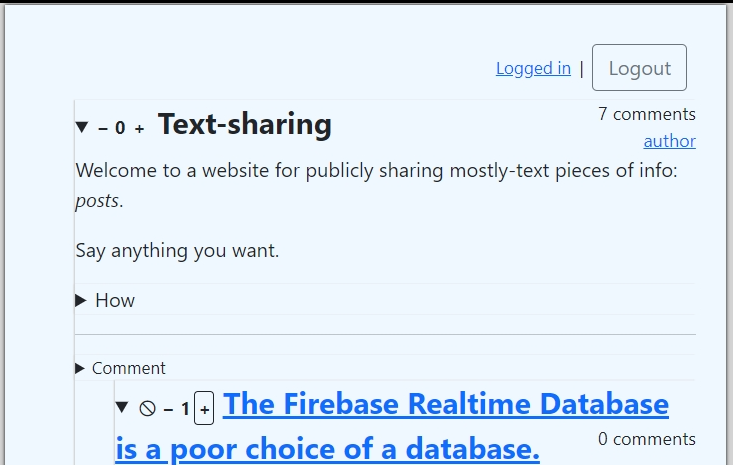
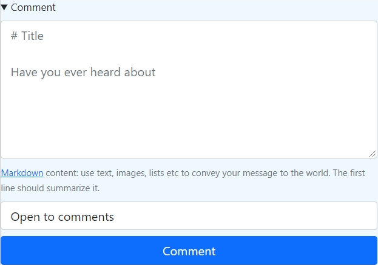
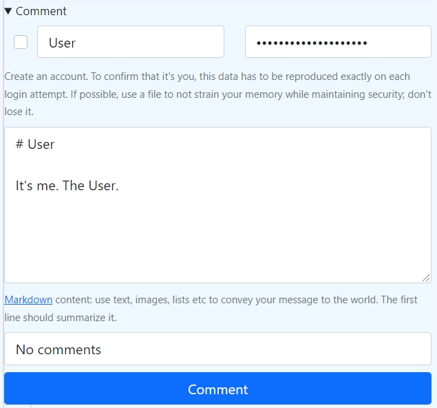

The source code for a site where users share *posts*: pieces of Markdown content.

Everything is a *post*: text, links, images, and even users that post. Users can vote on posts, which makes this a democracy I guess.

  

[Deployed on Heroku.](https://text-sharing-site.herokuapp.com)

This web server uses Rust and Firebase.

The site that it serves uses no JS, except for the signup/login form.

Life is hopeless, your death is one day closer every day, humanity is pointlessly cruel and hypocritical, and everything you could muster won't get even the slightest hint of warmth from it. I wish you well on the dark road ahead.